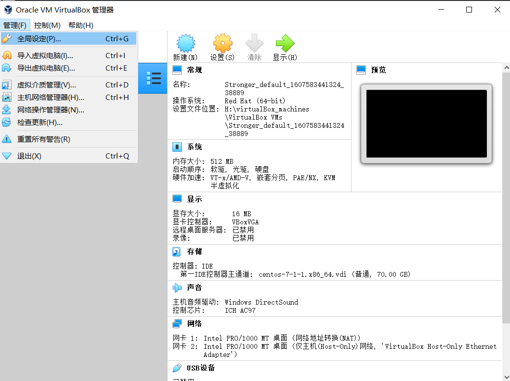
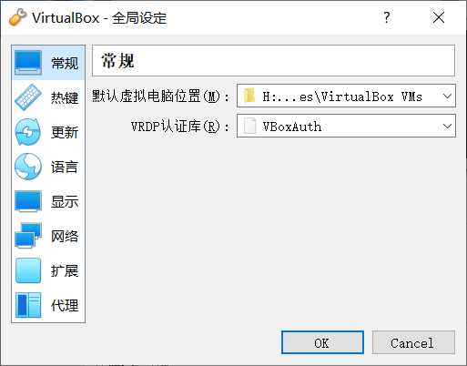
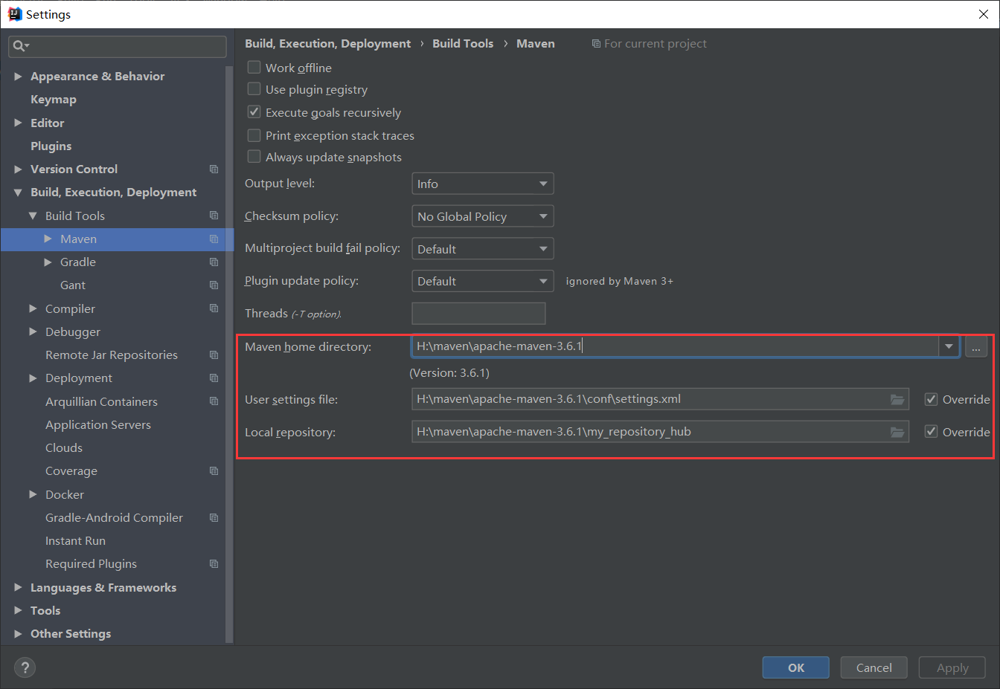
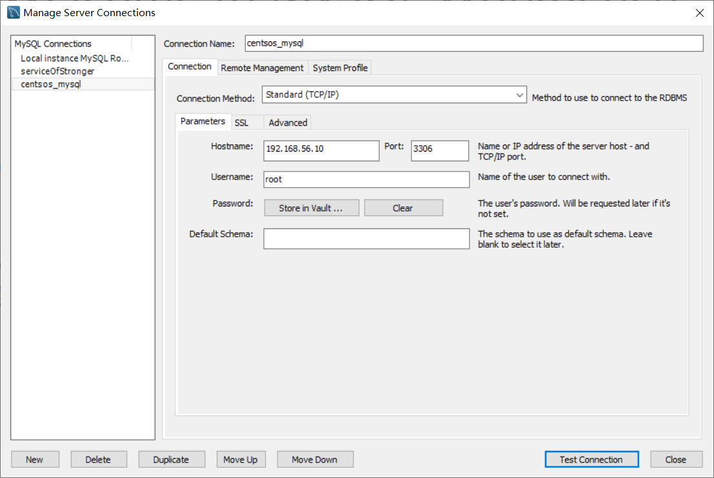

## 说明

仅用于本人记录自己的学习过程，这里是[教程网址](https://www.bilibili.com/video/BV1np4y1C7Yf)。


## 环境配置

### virtualBox安装

安装前

- 在bios中打开cpu虚拟化。

安装后

- 记得更改虚拟机位置（不是安装位置），否则虚拟机会默认存储在c盘。

  管理 -> 全局设定 -> 常规 -> 默认虚拟电脑位置

  

  


### vagrant安装与使用

安装

- 按照向导一步步安装即可。

使用

快速配置虚拟机，[官网](https://app.vagrantup.com/boxes/search)有各种box的名称，以centos/7为例。

```shell
# 初始化配置文件，在当前目录生成Vagrantfile文件
vagrant init centos/7

# 修改配置文件Vagrantfile的内容
# 编码
Encoding.default_external = 'UTF-8'
# 禁用共享文件，否则默认会把Vagrantfile同级目录下的所有文件和目录导入虚拟机的/vagrant目录
config.vm.synced_folder "./vagrant_share", "/vagrant", disabled:true
# 磁盘大小，需要首先使用命令vagrant plugin install vagrant-disksize安装插件
# 只能增大磁盘大小，并没有挂载磁盘分区，如果需要起作用，还需要进一步设置，此处其实无用
config.disksize.size = "70GB"
# 配置网络，在虚拟机网关的网段内，并且要和主机互相ping通
config.vm.network "private_network", ip: "192.168.56.10"

# ==================================完整的文件===============================================
# -*- mode: ruby -*-
# vi: set ft=ruby :

# All Vagrant configuration is done below. The "2" in Vagrant.configure
# configures the configuration version (we support older styles for
# backwards compatibility). Please don't change it unless you know what
# you're doing.
Vagrant.configure("2") do |config|
  # The most common configuration options are documented and commented below.
  # For a complete reference, please see the online documentation at
  # https://docs.vagrantup.com.

  # Every Vagrant development environment requires a box. You can search for
  # boxes at https://vagrantcloud.com/search.
  config.vm.box = "centos/7"

  # Disable automatic box update checking. If you disable this, then
  # boxes will only be checked for updates when the user runs
  # `vagrant box outdated`. This is not recommended.
  # config.vm.box_check_update = false

  # Create a forwarded port mapping which allows access to a specific port
  # within the machine from a port on the host machine. In the example below,
  # accessing "localhost:8080" will access port 80 on the guest machine.
  # NOTE: This will enable public access to the opened port
  # config.vm.network "forwarded_port", guest: 80, host: 8080

  # Create a forwarded port mapping which allows access to a specific port
  # within the machine from a port on the host machine and only allow access
  # via 127.0.0.1 to disable public access
  # config.vm.network "forwarded_port", guest: 80, host: 8080, host_ip: "127.0.0.1"

  # Create a private network, which allows host-only access to the machine
  # using a specific IP.
  config.vm.network "private_network", ip: "192.168.56.10"

  # Create a public network, which generally matched to bridged network.
  # Bridged networks make the machine appear as another physical device on
  # your network.
  # config.vm.network "public_network"

  # Share an additional folder to the guest VM. The first argument is
  # the path on the host to the actual folder. The second argument is
  # the path on the guest to mount the folder. And the optional third
  # argument is a set of non-required options.
  # config.vm.synced_folder "../data", "/vagrant_data"
  config.vm.synced_folder "./vagrant_share", "/vagrant", disabled:true

  # Provider-specific configuration so you can fine-tune various
  # backing providers for Vagrant. These expose provider-specific options.
  # Example for VirtualBox:
  #
  # config.vm.provider "virtualbox" do |vb|
  #   # Display the VirtualBox GUI when booting the machine
  #   vb.gui = true
  #
  #   # Customize the amount of memory on the VM:
  #   vb.memory = "1024"
  # end
  #
  # View the documentation for the provider you are using for more
  # information on available options.

  # Enable provisioning with a shell script. Additional provisioners such as
  # Puppet, Chef, Ansible, Salt, and Docker are also available. Please see the
  # documentation for more information about their specific syntax and use.
  # config.vm.provision "shell", inline: <<-SHELL
  #   apt-get update
  #   apt-get install -y apache2
  # SHELL
  Encoding.default_external = 'UTF-8'
  config.disksize.size = "70GB"
end
# ==========================================================================================

# ！不推荐！安装并启动（比较慢）
vagrant up

# ================================vagrant up 的替代方案=======================================
# 执行vagrant up命令时控制台会打印下载box的网址，自己去该网址下载
# 此处下载地址为 H:\virtualBox_boxes/CentOS-7-x86_64-Vagrant-2004_01.VirtualBox.box
# 加入box
vagrant box add centos/7 H:\virtualBox_boxes/CentOS-7-x86_64-Vagrant-2004_01.VirtualBox.box
# 开机
vagrant up
# ===========================================================================================

# ssh连接
vagrant ssh
```

vagrant常用命令

```shell
# 开机
vagrant up
# 关机
vagrant halt
# ssh连接
vagrant ssh
# 查看状态
vagrant status
# 删除虚拟机
vagrant destroy
# 一些信息
root用户密码为vagrant
```


### 安装docker

```shell
# ssh连接到虚拟机
# 安装
$ sudo yum remove docker \
                  docker-client \
                  docker-client-latest \
                  docker-common \
                  docker-latest \
                  docker-latest-logrotate \
                  docker-logrotate \
                  docker-engine

$ sudo yum install -y yum-utils \
  device-mapper-persistent-data \
  lvm2

$ sudo yum-config-manager \
    --add-repo \
    https://download.docker.com/linux/centos/docker-ce.repo

# 最新版本
# $ sudo yum install docker-ce docker-ce-cli containerd.io
# 指定版本
$ sudo yum install docker-ce-19.03.2 docker-ce-cli-19.03.2 containerd.io

# 启动
$ sudo systemctl start docker

# 查看版本
$ docker -v

# 查看镜像
$ sudo docker images

# 开机自启动
$ sudo systemctl enable docker

# 镜像加速（阿里云镜像加速器）
sudo mkdir -p /etc/docker
sudo tee /etc/docker/daemon.json <<-'EOF'
{
  "registry-mirrors": ["https://f45ro9s9.mirror.aliyuncs.com"]
}
EOF
sudo systemctl daemon-reload
sudo systemctl restart docker
```

docker常用命令

```shell
# 查看正在运行的容器
docker ps

# 停止容器
docker stop 容器id

# 删除容器
docker rm 容器id

# 删除镜像
docker rmi 镜像id
```


### 安装mysql

```shell
# 下载镜像
sudo docker pull mysql:5.7

# --name指定容器名字 -v目录挂载 -p指定端口映射 -e设置mysql参数
sudo docker run -p 3306:3306 --name mysql \
-v /mydata/mysql/log:/var/log/mysql \
-v /mydata/mysql/data:/var/lib/mysql \
-v /mydata/mysql/conf:/etc/mysql \
-e MYSQL_ROOT_PASSWORD=root \
-d mysql:5.7

# 进入/退出正在运行的容器
docker exec -it mysql bin/bash
exit

# 配置mysql
# 打开文件
vi /mydata/mysql/conf/my.conf

# 复制以下内容到文件
[client]
default-character-set=utf8
[mysql]
default-character-set=utf8
[mysqld]
init_connect='SET collation_connection = utf8_unicode_ci'
init_connect='SET NAMES utf8'
character-set-server=utf8
collation-server=utf8_unicode_ci
skip-character-set-client-handshake
skip-name-resolve

# 重启mysql
docker restart mysql
```


### 安装redis

```shell
# 下载镜像
docker pull redis:5.0.10

# 首先创建配置文件，否则为设为目录
mkdir -p /mydata/redis/conf
touch /mydata/redis/conf/redis.conf

docker run -p 6379:6379 --name redis \
-v /mydata/redis/data:/data \
-v /mydata/redis/conf/redis.conf:/etc/redis/redis.conf \
-d redis:5.0.10 redis-server /etc/redis/redis.conf

# 进入redis容器
docker exec -it redis redis-cli

# 持久化
vim /mydata/redis/conf/redis.conf
# 插入下面内容
appendonly yes

# 重启
docker restart redis
```


### 安装redis可视化工具

按照向导安装即可。

### 安装maven

安装

- 下载并解压
- bin目录添加到path环境变量

配置

修改maven的conf目录下的settings.xml文件，修改如下。

```xml
<!-- 配置仓库地址 -->
<localRepository>H:\maven\apache-maven-3.6.1\my_repository_hub</localRepository>

<!-- 配置阿里云镜像 -->
<mirror>
    <id>nexus-aliyun</id>
    <mirrorOf>central</mirrorOf>
    <name>Nexus aliyun</name>
    <url>http://maven.aliyun.com/nexus/content/groups/public</url> 
</mirror>

<!-- 配置jdk1.8编译项目 -->
<profile>
    <id>jdk-1.8</id>
    <activation>
        <activeByDefault>true</activeByDefault>
        <jdk>1.8</jdk>
    </activation>
    <properties>
        <maven.compiler.source>1.8</maven.compiler.source>
        <maven.compiler.target>1.8</maven.compiler.target>
        <maven.compiler.compilerVersion>1.8</maven.compiler.compilerVersion>
    </properties>
</profile>
```


### IDEA配置

#### 配置maven

config -> settings -> Build, Execution, Deployment -> Maven

修改maven home directory、User settings file、Local repository。



#### 安装插件

lombok、MyBatisx


### VS Code 配置

安装

略。

安装插件

- Auto Close Tag
- Auto Rename Tag
- Chinese (Simplified) Language Pack for Visual Studio Code
- ESLint
- HTML CSS Support
- HTML Snippets
- JavaScript (ES6) code snippets
- Live Server
- open in browser
- Vetur

### 配置git

略。

## 搭建项目框架

### 创建初始项目

- 使用github或者码云创建项目

- 使用idea从远程导入项目

  file -> new -> Project from Version Control -> git，输入仓库地址到URL，点击clone。

- 逐个创建微服务

  - 右键项目 -> new -> Module -> 左侧选择Spring Initializr -> next -> 填入Group、Artifact、Description，Java选择8 -> next -> 勾选web/spring web、spring cloud routing/openfeign -> next -> finish
  - 每个都要导入web、openfeign
  - 包名（Group）为com.atguigu.gulimall.xxx(product/order/ware/coupon/member)
  - 模块名（Artifact）为gulimall-xxx(product/order/ware/coupon/member)
  
- 用一个pom聚合所有微服务

  从任意一个微服务中复制一个pom到.idea同级目录，修改一下

  ```xml
  <?xml version="1.0" encoding="UTF-8"?>
  <project xmlns="http://maven.apache.org/POM/4.0.0" xmlns:xsi="http://www.w3.org/2001/XMLSchema-instance"
           xsi:schemaLocation="http://maven.apache.org/POM/4.0.0 https://maven.apache.org/xsd/maven-4.0.0.xsd">
      <modelVersion>4.0.0</modelVersion>
      <groupId>com.atguigu.gulimall</groupId>
      <artifactId>gulimall</artifactId>
      <version>0.0.1-SNAPSHOT</version>
      <name>gulimall</name>
      <description>聚合服务</description>
      <packaging>pom</packaging>
  
      <modules>
          <module>gulimall-coupon</module>
          <module>gulimall-member</module>
          <module>gulimall-order</module>
          <module>gulimall-product</module>
          <module>gulimall-ware</module>
      </modules>
  
  </project>
  ```

- 修改gitignore文件

  ```.gitignore
  target/
  pom.xml.tag
  pom.xml.releaseBackup
  pom.xml.versionsBackup
  pom.xml.next
  release.properties
  dependency-reduced-pom.xml
  buildNumber.properties
  .mvn/timing.properties
  # https://github.com/takari/maven-wrapper#usage-without-binary-jar
  .mvn/wrapper/maven-wrapper.jar
  
  **/mvnw
  **/mvnw.cmd
  
  **/.mvn
  **/target/
  
  .idea
  
  **/.gitignore
  ```

  

### 配置数据库

```shell
# 进入虚拟机，设置redis和mysql自动启动
sudo docker update redis --restart=always
sudo docker update mysql --restart=always
```

- 使用MySQL Workbench 8.0 CE或者其他数据库连接软件连接数据库

  

- 创建数据库，编码方式使用utf8mb4，名字依次为

  - gulimall_oms（对应gulimall-order）
  - gulimall_pms（对应gulimall-product）
  - gulimall_sms（对应gulimall-coupon）
  - gulimall_ums（对应gulimall-member）
  - gulimall_wms（对应gulimall-ware）

- 使用sql文件导入表和数据

  复制sql文件，执行。

### 搭建后台

使用人人开源中的[renren-fast](https://gitee.com/renrenio/renren-fast)作为脚手架。

克隆项目

```shell
git clone https://gitee.com/renrenio/renren-fast.git
```

删除项目的.git文件夹，复制项目到项目目录下（与gulimall-***同级目录）

添加到总的pom，允许maven自动导入（右下角会提示）

```xml
<modules>
    <module>gulimall-coupon</module>
    <module>gulimall-member</module>
    <module>gulimall-order</module>
    <module>gulimall-product</module>
    <module>gulimall-ware</module>
    <module>renren-fast</module>
</modules>
```

创建数据库和表

- 编码方式使用utf8mb4，名字为gulimall_admin

- 选中该数据库，复制renren-fast/db/mysql.sql内容，执行。

修改renren-fast的application-dev.yml中数据库信息，更改ip和数据库名称以及用户名密码

```yml
url: jdbc:mysql://192.168.56.10:3306/gulimall_admin?useUnicode=true&characterEncoding=UTF-8&serverTimezone=Asia/Shanghai
username: root
password: root
```

执行renren-fast，浏览器访问http://localhost:8080/renren-fast/

显示如下

```json
{"msg":"invalid token","code":401}
```


### 搭建前端

使用人人开源中的[renren-fast-vue](https://gitee.com/renrenio/renren-fast-vue)作为脚手架

克隆项目

配置node

使用vscode打开项目

运行

```shell
# 下载相关依赖
npm install
# 出错解决方案
npm install报错：chromedriver@2.27.2 install: node install.js
解决：
如果执行过npm install，先删除 node_modules 文件夹，不然运行的时候可能会报错
然后执行下面的命令
npm install chromedriver --chromedriver_cdnurl=http://cdn.npm.taobao.org/dist/chromedriver
再执行 npm install 即可正常下载

# 运行
npm run dev
```

打开网页即可看到页面。

后端同时运行则可以进行登录等操作，账号admin，密码admin。


## 生成代码

使用人人开源的[renren-generator](https://gitee.com/renrenio/renren-generator)项目生成相关代码，以gulimall-product为例。

- 克隆项目

- 复制到工程中

- 添加到总的pom中的modules

  ```xml
  <modules>
      ...
      <module>renren-generator</module>
  </modules>
  ```

- 修改application.yml中的数据库信息

  ```yml
  #MySQL配置
  driverClassName: com.mysql.cj.jdbc.Driver
  url: jdbc:mysql://192.168.56.10:3306/gulimall_pms?useUnicode=true&characterEncoding=UTF-8&useSSL=false&serverTimezone=Asia/Shanghai
  username: root
  password: root
  ```

- 修改generator.properties

  ```properties
  mainPath=com.atguigu
  #包名
  package=com.atguigu.gulimall
  moduleName=product
  #作者
  author=stronger
  #Email
  email=123456@gmail.com
  #表前缀(类名不会包含表前缀)
  tablePrefix=pms_
  ```

- 修改Controller生成规则，将RequiresPermissions相关的代码注释掉

  修改renren-generator\src\main\resources\template\Controller.java.vm文件。

  ```java
  package ${package}.${moduleName}.controller;
  
  import java.util.Arrays;
  import java.util.Map;
  
  // import org.apache.shiro.authz.annotation.RequiresPermissions;
  import org.springframework.beans.factory.annotation.Autowired;
  import org.springframework.web.bind.annotation.PathVariable;
  import org.springframework.web.bind.annotation.RequestBody;
  import org.springframework.web.bind.annotation.RequestMapping;
  import org.springframework.web.bind.annotation.RequestParam;
  import org.springframework.web.bind.annotation.RestController;
  
  import ${package}.${moduleName}.entity.${className}Entity;
  import ${package}.${moduleName}.service.${className}Service;
  import ${mainPath}.common.utils.PageUtils;
  import ${mainPath}.common.utils.R;
  
  
  
  /**
   * ${comments}
   *
   * @author ${author}
   * @email ${email}
   * @date ${datetime}
   */
  @RestController
  @RequestMapping("${moduleName}/${pathName}")
  public class ${className}Controller {
      @Autowired
      private ${className}Service ${classname}Service;
  
      /**
       * 列表
       */
      @RequestMapping("/list")
      // @RequiresPermissions("${moduleName}:${pathName}:list")
      public R list(@RequestParam Map<String, Object> params){
          PageUtils page = ${classname}Service.queryPage(params);
  
          return R.ok().put("page", page);
      }
  
  
      /**
       * 信息
       */
      @RequestMapping("/info/{${pk.attrname}}")
      // @RequiresPermissions("${moduleName}:${pathName}:info")
      public R info(@PathVariable("${pk.attrname}") ${pk.attrType} ${pk.attrname}){
  		${className}Entity ${classname} = ${classname}Service.getById(${pk.attrname});
  
          return R.ok().put("${classname}", ${classname});
      }
  
      /**
       * 保存
       */
      @RequestMapping("/save")
      // @RequiresPermissions("${moduleName}:${pathName}:save")
      public R save(@RequestBody ${className}Entity ${classname}){
  		${classname}Service.save(${classname});
  
          return R.ok();
      }
  
      /**
       * 修改
       */
      @RequestMapping("/update")
      // @RequiresPermissions("${moduleName}:${pathName}:update")
      public R update(@RequestBody ${className}Entity ${classname}){
  		${classname}Service.updateById(${classname});
  
          return R.ok();
      }
  
      /**
       * 删除
       */
      @RequestMapping("/delete")
      // @RequiresPermissions("${moduleName}:${pathName}:delete")
      public R delete(@RequestBody ${pk.attrType}[] ${pk.attrname}s){
  		${classname}Service.removeByIds(Arrays.asList(${pk.attrname}s));
  
          return R.ok();
      }
  
  }
  ```

- 启动项目生成代码，将代码下载。

  启动后打开[网页](http://localhost:80/)，点击左侧renren-fast，将每页设为50条（大一些可以一次下载完），全选，生成代码。

  

## 整合代码

删除main/resource中的src

复制main到gulimall-product中的main

新建maven模块名字为gulimall-common（最后一步会把-去掉变为gulimallcommon，手动改一下即可），用来存放其他模块的共同依赖。

在总的pom中添加gulimall-common

```xml
<modules>
    ...
    <module>gulimall-common</module>
</modules>
```

在gulimall-common项目的pom中添加描述、依赖

```xml
<description>每一个微服务公共的依赖，如bean，工具类等。</description>

<dependencies>
    <!-- lombok -->
    <dependency>
        <groupId>org.projectlombok</groupId>
        <artifactId>lombok</artifactId>
        <version>1.18.8</version>
    </dependency>
    <!-- httpcomponents -->
    <dependency>
        <groupId>org.apache.httpcomponents</groupId>
        <artifactId>httpcore</artifactId>
        <version>4.4.12</version>
    </dependency>
    <!-- StringUtils -->
    <dependency>
        <groupId>commons-lang</groupId>
        <artifactId>commons-lang</artifactId>
        <version>2.6</version>
    </dependency>
    <dependency>
        <groupId>javax.servlet</groupId>
        <artifactId>servlet-api</artifactId>
        <version>2.5</version>
        <scope>provided</scope>
    </dependency>
    <!-- mabatis plus -->
    <dependency>
        <groupId>com.baomidou</groupId>
        <artifactId>mybatis-plus-boot-starter</artifactId>
        <version>3.2.0</version>
    </dependency>
</dependencies>
```

将renren-fast中的一些类复制到gulimall-common中

- 将renren-fast模块java/io/common/exception中的RRException和java/io/common/utils中的Constant、PageUtil、Query、R复制到gulimall-common中的java/com/atguigu/common/utils中（需要自己创建包）
- 将renren-fast模块java/io/common/xss中的HTMLFilter和SQLFilter复制到gulimall-common中的java/com/atguigu/common/xss中

在product的pom中添加依赖

```xml
<dependency>
    <groupId>com.atguigu.gulimall</groupId>
    <artifactId>gulimall-common</artifactId>
    <version>0.0.1-SNAPSHOT</version>
</dependency>
```

修复gulimall-product中的错误。如果缺少共有的依赖，就上网搜依赖的maven，并添加到gulimall-common中；如果缺少文件，就到renren-fast项目中寻找，也添加到gulimall-common中。

## 整合mybatis plus

1. 在gulimall-common的pom中导入mabatis plus依赖（前边已经添加）

   ```xml
   <!-- mabatis plus -->
   <dependency>
       <groupId>com.baomidou</groupId>
       <artifactId>mybatis-plus-boot-starter</artifactId>
       <version>3.2.0</version>
   </dependency>
   ```

2. 配置
   1. 配置数据源

      1. 在gulimall-common的pom中导入数据库驱动依赖

         ```xml
         <!-- 导入mysql驱动 -->
         <dependency>
             <groupId>mysql</groupId>
             <artifactId>mysql-connector-java</artifactId>
             <version>8.0.17</version>
         </dependency>
         ```

      2. 在gulimall-product的application.yml（没有该文件则新建）中配置数据源相关信息

         ```yml
         spring:
           datasource:
             username: root
             password: root
             url: jdbc:mysql://192.168.56.10:3306/gulimall_pms?useUnicode=true&characterEncoding=UTF-8&serverTimezone=Asia/Shanghai
             driver-class-name: com.mysql.cj.jdbc.Driver
         ```

   2. 配置mybatis plus

      1. 在GulimallProductApplication.java中添加@mappperScan注解

         ```java
         @MapperScan("com.atguigu.gulimall.product.dao")
         @SpringBootApplication
         public class GulimallProductApplication {
         
             public static void main(String[] args) {
                 SpringApplication.run(GulimallProductApplication.class, args);
             }
         
         }
         ```

      2. 在gulimall-product的application.yml中配置sql映射文件位置等信息

         ```yml
         mybatis-plus:
           mapper-locations: classpath:/mapper/**/*.xml
           global-config:
             db-config:
               id-type: auto
         ```

         

## 其他模块

### 一般流程

以gulimall-coupon为例。

修改renren-generator模块的generator.properties，修改包名和表前缀

```properties
#包名
moduleName=coupon

#表前缀(类名不会包含表前缀)
tablePrefix=sms_
```

修改renren-generator模块的application.yml，修改数据库名称

```yml
url: jdbc:mysql://192.168.56.10:3306/gulimall_sms?useUnicode=true&characterEncoding=UTF-8&useSSL=false&serverTimezone=Asia/Shanghai
```

启动renren-generator模块，生成代码

删除main/resource中的src

复制main到gulimall-coupon中的main

在gulimall-coupon的pom添加对gulimall-common的依赖

```xml
<dependency>
    <groupId>com.atguigu.gulimall</groupId>
    <artifactId>gulimall-common</artifactId>
    <version>0.0.1-SNAPSHOT</version>
</dependency>
```

配置gulimall-coupon的application.yml（没有该文件则新建），和product一样，唯一不同是数据库名称

```yml
spring:
  datasource:
    username: root
    password: root
    url: jdbc:mysql://192.168.56.10:3306/gulimall_sms?useUnicode=true&characterEncoding=UTF-8&serverTimezone=Asia/Shanghai
    driver-class-name: com.mysql.cj.jdbc.Driver

mybatis-plus:
  mapper-locations: classpath:/mapper/**/*.xml
  global-config:
    db-config:
      id-type: auto

```

// 添加@mappperScan注解（没有添加为什么也可以）

运行模块并测试，在浏览器中打开该网页调用请求（coupon/coupon/list为模块名/表名/请求名）

http://localhost:8080/coupon/coupon/list

返回结果为

```json
{"msg":"success","code":0,"page":{"totalCount":0,"pageSize":10,"totalPage":0,"currPage":1,"list":[]}}
```

这样就配置完成了。


### 配置端口

在5个模块的application.yml文件中配置服务器端口

```yml
server:
  port: 7000
```

端口号依次为：

- coupon设置为7000
- member设置为8000
- order设置为9000
- product设置为10000
- ware设置为11000


## 版本变更

由于之前使用的一些配置版本和教程不一致，出现了很多不必要的问题，所以首先改一下版本。

gulimall-***(coupon/member/order/product/ware)

```xml
<!-- 修改spring boot版本 -->
<parent>
    <groupId>org.springframework.boot</groupId>
    <artifactId>spring-boot-starter-parent</artifactId>
    <version>2.1.8.RELEASE</version>
    <relativePath/> <!-- lookup parent from repository -->
</parent>

<!-- 修改spring-cloud.version -->
<properties>
    <java.version>1.8</java.version>
    <spring-cloud.version>Greenwich.SR3</spring-cloud.version>
</properties>

<!-- 删掉repositories，为了保持一致所以删了，不知道有什么后果 -->
```

然后修改test文件。


## 分布式配置

### nacos注册中心

可以参考[官方中文教程](https://github.com/alibaba/spring-cloud-alibaba/blob/master/spring-cloud-alibaba-examples/nacos-example/nacos-config-example/readme-zh.md)。

1. 在common中添加alibaba cloud和nacos的依赖

   ```xml
   <!--nacos注册中心-->
   <dependencies>
       ...
       <dependency>
           <groupId>com.alibaba.cloud</groupId>
           <artifactId>spring-cloud-starter-alibaba-nacos-discovery</artifactId>
       </dependency>
   </dependencies>
   
   <dependencyManagement>
       <dependencies>
           <dependency>
               <groupId>com.alibaba.cloud</groupId>
               <artifactId>spring-cloud-alibaba-dependencies</artifactId>
               <!--教程中用的2.1.0.RELEASE版本-->
               <!--如果使用教程的版本，会找不到nacos服务器，原因没找到-->
               <version>2.1.2.RELEASE</version>
               <type>pom</type>
               <scope>import</scope>
           </dependency>
       </dependencies>
   </dependencyManagement>
   ```

2. 在对应的微服务（以gulimall-member为例）的application.yml（没有该文件就新建）添加nacos服务器地址，要注册的微服务名称

   ```yml
   spring:
     ...
     cloud:
       nacos:
         server-addr: 127.0.0.1:8848
     application:
       name: gulimall-member
   ```

3. 在GulimallMemberApplication.java中添加注解@EnableDiscoveryClient

   ```java
   @EnableDiscoveryClient
   @SpringBootApplication
   public class GulimallMemberApplication {
   
       public static void main(String[] args) {
           SpringApplication.run(GulimallMemberApplication.class, args);
       }
   
   }
   ```

4. 下载nacos1.1.3(Aug 6th, 2019)并运行

   到网页[1.1.3(Aug 6th, 2019)](https://github.com/alibaba/nacos/releases/tag/1.1.3)下载[nacos-server-1.1.3.zip](https://github.com/alibaba/nacos/releases/download/1.1.3/nacos-server-1.1.3.zip)。

   下载后解压，双击bin目录下startup.cmd运行，打开网址 http://127.0.0.1:8848/nacos/ ，账号密码均为nacos，登陆后点开服务管理->服务列表。

5. 运行微服务（以gulimall-member为例）

   运行应用，刷新nacos网页的界面可以看到服务。

### openfeign调用已注册的服务

使用member服务调用coupon服务中的，作为示例。

在CouponController中添加被调用的方法membercoupons()

```java
// 测试远程调用
@RequestMapping("/member/list")
public R membercoupons(){
    CouponEntity couponEntity = new CouponEntity();
    couponEntity.setCouponName("满100减10");
    return R.ok().put("coupons",Arrays.asList(couponEntity));
}
```

为了在member中调用membercoupons()方法，我们首先需要做如下配置。

1. 在member的pom中引入openfeign依赖（之前已经引入了）

   ```xml
   <dependency>
       <groupId>org.springframework.cloud</groupId>
       <artifactId>spring-cloud-starter-openfeign</artifactId>
   </dependency>
   ```

2. 声明远程接口

   在gulimall-member中创建com.atguigu.gulimall.member.feign包，用来存放接口。创建接口CouponFeignService

   ```java
   package com.atguigu.gulimall.member.feign;
   
   import com.atguigu.common.utils.R;
   import org.springframework.cloud.openfeign.FeignClient;
   import org.springframework.web.bind.annotation.RequestMapping;
   
   // 调用的服务名
   @FeignClient("gulimall-coupon")
   public interface CouponFeignService {
   
       // 被调用的方法对应的url，函数名任意命名，不一定是membercoupons。
       @RequestMapping("/coupon/coupon/member/list")
       public R membercoupons();
   
   }
   
   ```

3. 在GulimallMemberApplication.java中添加@EnableFeignClients注解

   ```java
   // 远程接口的路径
   @EnableFeignClients(basePackages = "com.atguigu.gulimall.member.feign")
   @SpringBootApplication
   public class GulimallMemberApplication {
   
       public static void main(String[] args) {
           SpringApplication.run(GulimallMemberApplication.class, args);
       }
   
   }
   ```

然后，我们就可以通过调用接口中的方法来调用coupon中的方法，例如在MemberController中添加如下方法

```java
@RequestMapping("/coupons")
public R test(){
    MemberEntity memberEntity = new MemberEntity();
    memberEntity.setNickname("张三");

    R membercoupons = couponFeignService.membercoupons();
    return R.ok().put("member",memberEntity).put("coupons",membercoupons.get("coupons"));
}
```

分别运行coupon服务和member服务，输入网址http://localhost:8000/member/member/coupons，输出如下

```json
{"msg":"success","code":0,"coupons":[{"id":null,"couponType":null,"couponImg":null,"couponName":"满100减10","num":null,"amount":null,"perLimit":null,"minPoint":null,"startTime":null,"endTime":null,"useType":null,"note":null,"publishCount":null,"useCount":null,"receiveCount":null,"enableStartTime":null,"enableEndTime":null,"code":null,"memberLevel":null,"publish":null}],"member":{"id":null,"levelId":null,"username":null,"password":null,"nickname":"张三","mobile":null,"email":null,"header":null,"gender":null,"birth":null,"city":null,"job":null,"sign":null,"sourceType":null,"integration":null,"growth":null,"status":null,"createTime":null}}
```


### nacos配置中心

使用配置中心可以将配置信息从application.properties等本地文件移动到nacos，这样做的好处有很多，如多个机器运行同一个服务，那么他们可以共享配置而无需一一配置。

首先说明nacos配置空间的界面，数据集可以理解为配置文件，数据集id可以理解为文件名，命名空间可以理解为文件夹，用来分隔数据集，分组可以看作标签。


一个应用可能包含很多个微服务，为了让配置信息更加清晰，可以将一个微服务的配置信息放在一个命名空间中。应用在开发、测试、上线的时候配置一般是不同的，为了区分不同时期的配置，可以用group来标记时期。这些并不是强制的，而是一种习惯性的用法。

以下以coupon为例，说明如何使用nacos配置中心。

1. 在common的pom中引入依赖

   ```xml
   <!--nacos配置中心-->
   <dependency>
       <groupId>com.alibaba.cloud</groupId>
       <artifactId>spring-cloud-starter-alibaba-nacos-config</artifactId>
   </dependency>
   ```

2. 在coupon的resources目录下创建bootstrap.properties文件（与application.properties同一级目录），说明微服务的名称和nacos服务器的地址。微服务默认会加载服务器端的public命名空间的默认分组的gulimall-coupon.properties（${spring.application.name}.properties），如果nacos中的配置和本地的重名，优先使用nacos中的配置。

   ```properties
   spring.application.name=gulimall-coupon
   spring.cloud.nacos.config.server-addr=127.0.0.1:8848
   
   # 指定命名空间ID
   spring.cloud.nacos.config.namespace=49e0b984-2eef-4ec0-9cb9-27fb0f651715
   # 指定分组
   spring.cloud.nacos.config.group=prod
   
   # 引入多个配置，这些配置会在下一步创建
   spring.cloud.nacos.config.extension-configs[0].data-id=datasource.yml
   spring.cloud.nacos.config.extension-configs[0].group=dev
   # 如果nacos中的该项配置修改，自动更新
   spring.cloud.nacos.config.extension-configs[0].refresh=true
   
   spring.cloud.nacos.config.extension-configs[1].data-id=mybatis.yml
   spring.cloud.nacos.config.extension-configs[1].group=dev
   spring.cloud.nacos.config.extension-configs[1].refresh=true
   
   spring.cloud.nacos.config.extension-configs[2].data-id=other.yml
   spring.cloud.nacos.config.extension-configs[2].group=dev
   spring.cloud.nacos.config.extension-configs[2].refresh=true
   ```

3. nacos的网页中添加配置

   首先新建namespace，名字为coupon，然后在该命名空间中创建配置文件，分别为

   gulimall-coupon.properties，group为prod

   ```properties
   coupon.user.name=zhangsan
   coupon.user.age=20
   ```

   datasource.yml，group为dev

   ```yml
   spring:
     datasource:
       username: root
       password: root
       url: jdbc:mysql://192.168.56.10:3306/gulimall_sms?useUnicode=true&characterEncoding=UTF-8&serverTimezone=Asia/Shanghai
       driver-class-name: com.mysql.cj.jdbc.Driver
   ```

   mybatis.yml，group为dev

   ```yml
   mybatis-plus:
     mapper-locations: classpath:/mapper/**/*.xml
     global-config:
       db-config:
         id-type: auto
   ```

   other.yml，group为dev

   ```yml
   spring:
     cloud:
       nacos:
         server-addr: 127.0.0.1:8848
     application:
       name: gulimall-coupon
   
   server:
     port: 7000
   ```

4. 测试配置是否奏效

   在CouponController.java中添加注解@RefreshScope（gulimall-coupon.properties的值变化的话配置会自动更新），并添加访问配置的代码。

   ```java
   @RefreshScope
   @RestController
   @RequestMapping("coupon/coupon")
   public class CouponController {
       
       ....
           
       @Value("${coupon.user.name}")
       private String name;
       @Value("${coupon.user.age}")
       private Integer age;
   
       @RequestMapping("/test")
       public R test(){
           return R.ok().put("name",name).put("age",age);
       }
       
       ...
       
   }
   ```

   运行微服务，访问网页 http://localhost:7000/coupon/coupon/test ，可以看到配置的值，在nacos中修改配置，再次访问，如果变化则说明已经奏效。


## 网关

使用Spring Initializr创建模块，Group为com.atguigu.gulimall，Artifact为gulimall-gateway，package为com.atguigu.gulimall.gateway，搜索gateway选中。按照前边版本变更一节对pom进行修改，并引入common依赖。

为gulimall-gateway配置nacos注册中心和nacos配置中心，修改端口号为88，配置路由条件。详细操作为

在nacos网页中创建命名空间gateway，然后在该命名空间中创建数据集gulimall-gateway.yml，分组为默认分组，内容为

```yml
spring:
    application:
        name: gulimall-gateway
```

application.properties修改为

```properties
# 注册中心
spring.cloud.nacos.discovery.server-addr=127.0.0.1:8848
spring.application.name=gulimall-gateway
server.port=88
```

application.yml修改为

```yml
spring:
  cloud:
    gateway:
      routes:
        - id: test_route
          uri: https://www.baidu.com
          predicates:
            - Query=url,baidu

        - id: qq_route
          uri: https://www.qq.com
          predicates:
            - Query=url,qq
```

bootstrap.properties修改为

```properties
# 配置中心
spring.application.name=gulimall-gateway
spring.cloud.nacos.config.server-addr=127.0.0.1:8848
spring.cloud.nacos.config.namespace=780763eb-4007-4bc9-80e9-24336c8ef6c1
```

打开网页 http://localhost:88/hello?url=qq ，如果可以导航到qq网站（可能没页面，因为qq没有hello对应的界面，只要跳转了就行），说明配置成功。

